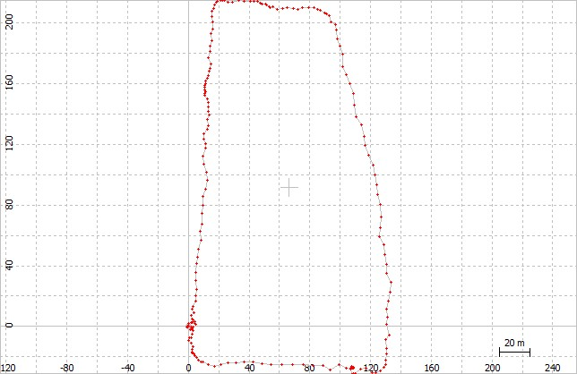
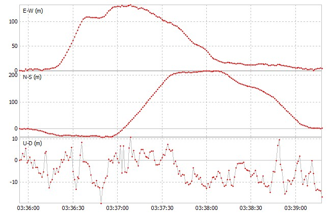
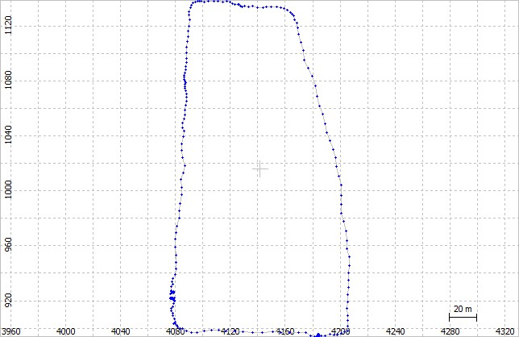
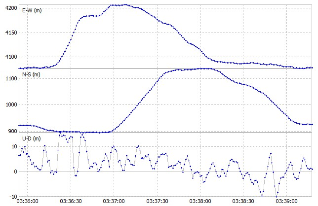
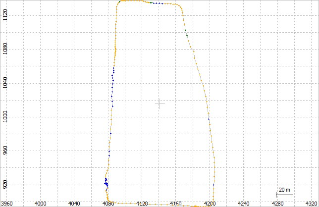
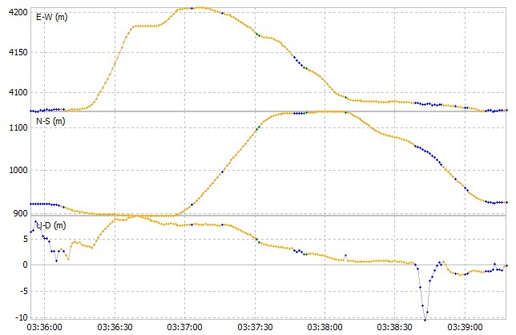
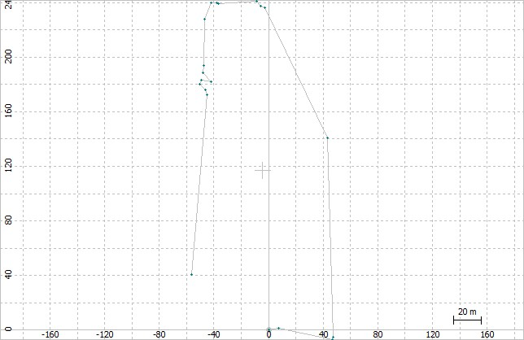
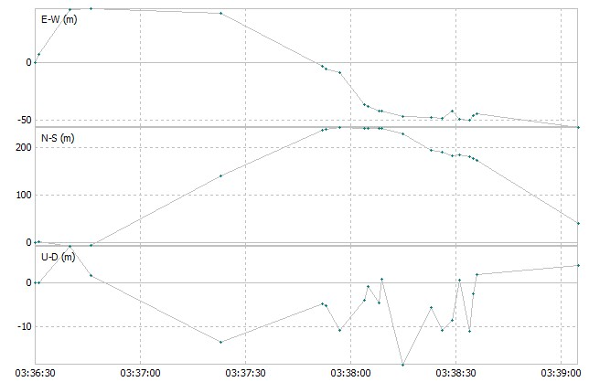
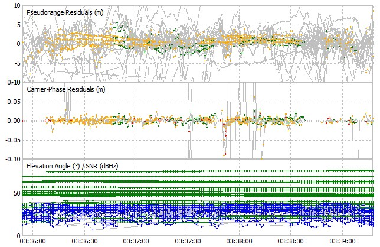
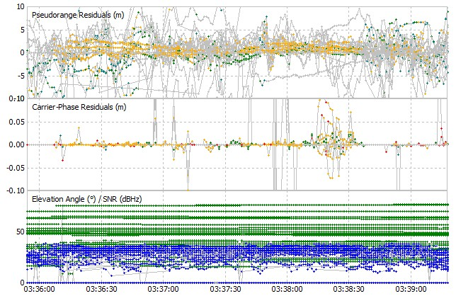

  <h3 align="center">AAE6102</h3>

  

    Laboratory Group 5  
    Choi Yan To 23125113R  
    Zou Kang 23131946R
  

---

## GNSS Library Selection

We selected the RTKLIB for processing the GNSS data in this laboratory. Certain parameters were tuned to assess the affect on performance by different parameters configurations.

## 1. Parameter Tuning and Effects

We processed the Dynamic data by selecting four algorithms provided in the RTKLIB, the four positioning mode included: (1) single, (2) DGPS, (3) Kinematic, and (4) PPP Kinematic
### 1.1 Different positioning modes
#### (a) Positioning mode: Single    

Trajectory:  

Position:  

#### (b) Positioning mode: DGPS    

Trajectory:  

Position:  

#### (c) Positioning mode: Kinematic   

Trajectory:  

Position:  

#### (d) Positioning mode: PPP_kinematic  

Trajectory:  

Position:  

Remarks:
Only the PPP kinematic show a poor result, as the PPP Kinematic trajectory is likely incomplete. Here are a possible reason for that: PPP-K requires huge amount of convergence time to come up with a solution.

#### (e) Explain  
- By observing the above outputs of using the four positioning mode, only PPP Kinamtic show a poor results compared to the other three. 
- When focusing on N-E directions, Single, DGPS, Kinematic displayed a similar performance
- WHen focusing on Height dimension, Single and DGPS show a fluctuaing pattern in change of height, while Kinematic show a smooth change of height
- Overall Kinematic positioning mode is the best in terms of positioning performance

(<a href="#top">back to top</a>)

### 1.2 Parameters tuning  

The following show some general parameters. These paramters were changed and tuned by multiple trials in Kinematic mode.  

| Parameter         | Remarks       |Positioning accuracy              | Processing time  |Robustness to challenging conditions|
|-------------------|-----------------------------------|------------------|-----------------|-----------------|
|Filter Type|Foward; Backward; Combined|Combined increase accuracy|Foward < Backward < Combined|Foward < Backward < Combined|
|Elevation Mask (°)|Excludes satellites below a specific elevation angle|increase accuracy by excluding low elevation satellites|--|Stricter mask increase robustness|
|Iono Correction|Corrects ionospheric delays|IONEX TEC > Estimate TEC > ... > Broadcast|IONEX TEC > Estimate TEC > ... > Broadcast|--|
|Tropo Correction|Corrects tropospheric delays|Estimate ZTD > SBAS / Saastamoinen|Estimate ZTD > SBAS / Saastamoinen|--|
|Max Age of Diff |tested 30s and 60s|30s better than 60s|similar|lower value shall enhance robustness in dynamic situation|
|Max Pos Var for AR/AR Filter|tested 0.1 and 0.5|0.1 generate smoother position curve|similar|0.1 generate smoother position curve|

Beside, we tested the Frequencies configuration in Kinematic mode. There are different frequencies configuration include: L1,L1+L2, L1+L2+L5, L1+L2+L5+L6  
The following show the residual plots of different frequency configurations.  

L1+L2:  

L1+L2+L5:  

L1+L2+L5+L6:  

It was suggested that L5 can combat multipath error effectively in the urban canyon. Therefore, we specifically test different frequency configuration. 
By observation, L1+L2 has similar performance compared to L1+L2+L5. For L1+L2+L5+L6, the residuals plots are more clustered in 0 value overall. However last 70% part residual suddenly increased in carrier phase residuals. By considering the whole picture, L1+L2+L5 is recommended. 

## 2. Strengths and Limitations

### 2.1 Single
Strength:
- Fast and simple. Just require a single receiver
- efficient for fast application such as tracking
- do not require external reference station for receiving correction data

Limitation:
- accuracy is poor. compared to DGPS and RTK, the accuracy is low in North-west direction and Height dimension
- Do not have any mechanism to tackle challenging scenarios such as urban canyons
- Do not solve tropospheric, ionospheric, and multipath error and delay

### 2.2 DGPS
Strength:
- higher accuracy compared to single positioning mode 
- Robust method in positioning. Serve as a baseline accuracy for further advanced positioning method
- Correct most of the common error that single positioning mode do not account for, such as clock eror, atmospheric error

Limitation:
- Require access of local reference stations. the region should have densly and evenly established reference stations.
- Accuracy solely rely on the distance to the reference station, the closer the more accurate
- In general it is a better algorithm compared to single, yet limited correction method hinders the performance

### 2.3 Kinematic
Strength:
- commercial grade, high accuracy. precision can up to centimeter to decimeter level
- suitable for real-time navigation and tracking
- features carrier phase correction to eliminate various error source, which outperformed DGPS

Limitation:
- same with DGPS, require dense reference stations for promising positioning accuracy
- accuracy relies on local signal and distance to the reference station
- multipath effect in urban canyon still harm the accuracy, while hopefully certain frequency configuration could mitigate the affect
- computationally expensive for extended kalman filter

### 2.4 PPP Kinematic
Strength:
- Different from DGPS and RTK, PPP do not require any reference station
- huge strength in global and continental positioning
- also capable of reaching centimeter level positioning with high precision
- able to correct various error such as clock, satellite orbit, and atmospheric delay

Limitation:
- huge convergence time is required to achieve hgih accuracy
- difficult for real time urban tracking 
- computationally expensive

## 3. Suggestion for Improvement
### 3.1 Improve the GUI
It is suggested to simplify the user interface for beginners as some GNSS data user are not GNSS-specialist (for example Land Surveyor). The processing workflow can be streamlined and allow user to process the data without any manual modification of parameters and steps. Moreover, each parameters and algorithms shall provide documentation in the GUI. It is hard to google search each function and parameter while using the RTKLIB software. More, the GUI should include showing the real world map while plotting the GNSS positioning result. The developer may consider 3d map such as Open3DHK just released by the Lands Department in Hong Kong.

### 3.2 Improve the accuracy
The RTKLIB should provide or make it campatible to more algorithms tailored for mitigating error such as atmopsheric delay or multipath error. There are some existing algorithms utlize Deep Learning or Machine Learning. Besides, the softare should adopt certian advanced ambiguity resolution algorithms should as PAR, LAMBDA++ to foester the efficiency and preicison . 

### 3.3 Suggestion from user-prespective
THe GUI should support processing all the positioning algorithm simultaneously. For example, single, DGPS, RTK, etc, the RTKLIB should allow processing with different algorithms simultaneously instead of processing one by one controlled by the user. Besides, parameters selection and tunin is crucial for acquiring precise positioning result. Grid search function should included, so the user do not required to tune the parameters by trial and errors to obtain promising results

(<a href="#top">back to top</a>)

